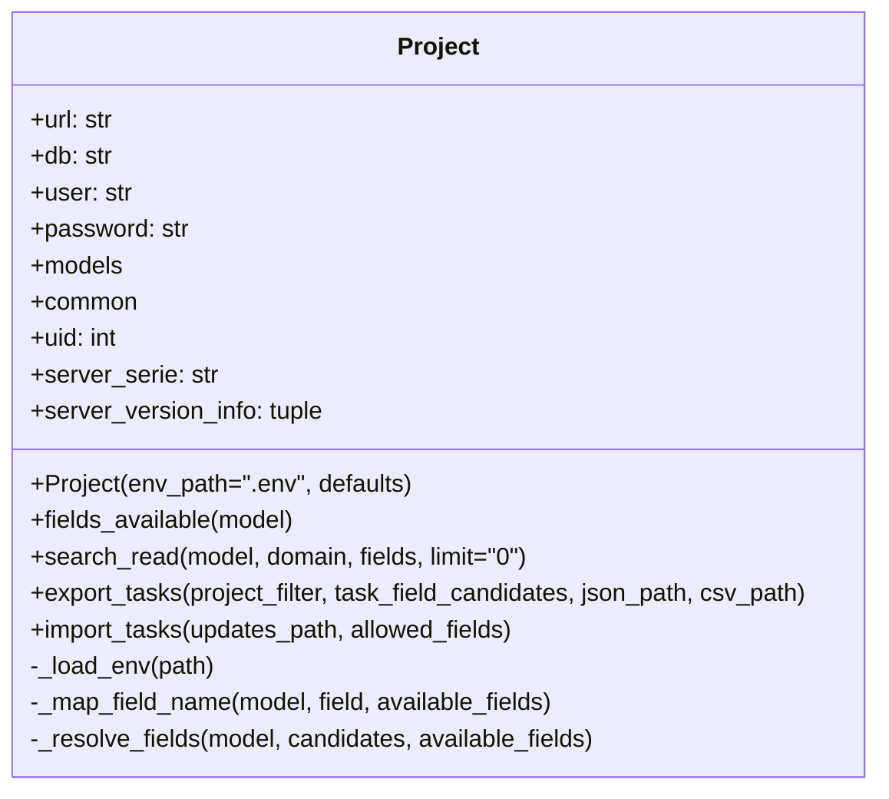

# MyXMLRPCOdooIOScript

Ce projet regroupe deux scripts Python qui exportent et importent des taches Odoo via l'API XML-RPC. Une classe `Project` centralise le chargement de la configuration, l'authentification, les appels partages et controle que l'instance visee execute Odoo 18.x ou plus recent.

## Compatibilite Odoo 18
- Verification de version : un appel `common.version()` est realise lors de l'initialisation et l'execution est interrompue si le serveur est en dessous de la version 18.
- Alias de champs : les scripts gèrent automatiquement les renommages introduits en V18 (`planned_date_begin` -> `date_planned_start`, `planned_hours` -> `allocated_hours`, etc.) afin que les exports et imports restent fonctionnels meme si vos fichiers utilisent les anciennes appellations.
- Metadonnees d'export : les fichiers generes contiennent la serie et la version du serveur ainsi que les correspondances de champs appliquees, ce qui facilite les verifications et audits.

## Diagramme des classes


## Champs proposes
- **Export** : par defaut `export_project.py` demande les principaux champs V18 des taches (ex. `task_type_id`, `milestone_id`, `allocated_hours`, `date_planned_start`, ...). Les champs absents sont ignores automatiquement.
- **Import** : `import project.py` autorise la mise a jour des champs de planification (anciennes et nouvelles denominations), de la priorite, de la facturation (`allow_billable`) et des jalons (`milestone_id`). Ajustez les constantes `TASK_FIELD_CANDIDATES` et `ALLOWED_FIELDS` selon vos besoins.

## Prerequis
- Python 3.9 ou plus recent (les modules utilises font partie de la bibliotheque standard).
- Acces a un serveur Odoo 18.x via XML-RPC (`https://votre-instance.odoo.com/xmlrpc/2/`).

## Configuration
1. Dupliquez `.env` (ou creez-le a partir du modele ci-dessous) et renseignez vos identifiants Odoo :
   ```env
   ODOO_URL=https://votre-instance.odoo.com
   ODOO_DB=nom_de_la_base
   ODOO_USER=email@example.com
   ODOO_PASSWORD=mot_de_passe
   ```
2. Ajustez `export_project.py` et `import project.py` si vous souhaitez modifier le filtre projet, les champs exportes ou importes par defaut.

## Utilisation
Lancez les commandes depuis le dossier racine du projet.

### Export des taches
- **Windows (PowerShell ou CMD)** :
  ```powershell
  python export_project.py
  ```
  (Si plusieurs versions de Python sont installees, utilisez `py -3 export_project.py`).

- **Linux / macOS (terminal)** :
  ```bash
  python3 export_project.py
  ```

Les fichiers `tasks.json` et `tasks.csv` seront generes dans le repertoire courant.

### Import / mise a jour des taches
Assurez-vous que `tasks_to_update.json` contient les donnees a importer.

- **Windows** :
  ```powershell
  python "import project.py"
  ```

- **Linux / macOS** :
  ```bash
  python3 "import project.py"
  ```

Le script affiche le nombre de taches mises a jour (`OK`) et celles en erreur (`KO`).

## Conseils
- Ne committez pas votre fichier `.env` (il est deja ajoute a `.gitignore`).
- Lancez d'abord l'export pour verifier la connexion a Odoo et la correspondance des champs avant de proceder a l'import.
- Consultez la section "Champs proposes" pour verifier que les identifiants utilises correspondent bien a votre configuration fonctionnelle.
