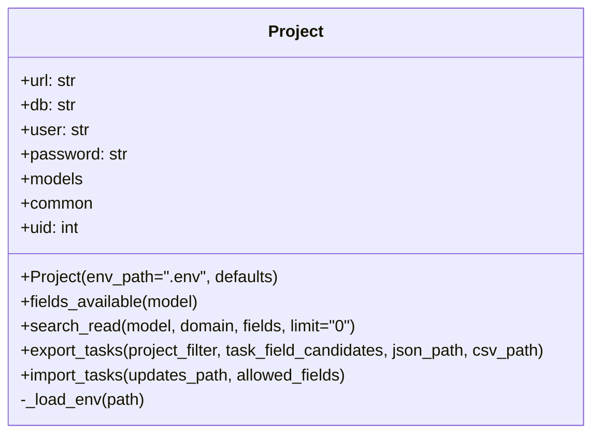

# MyXMLRPCOdooIOScript

Ce projet regroupe deux scripts Python qui exportent et importent des taches Odoo via l'API XML-RPC. Une classe `Project` centralise le chargement de la configuration, l'authentification et les appels partages.

## Diagramme des classes


## Prerequis
- Python 3.9 ou plus recent (les modules utilises font partie de la bibliotheque standard)
- Acces a un serveur Odoo via XML-RPC

## Configuration
1. Dupliquez `.env` (ou creez-le a partir du modele ci-dessous) et renseignez vos identifiants Odoo :
   ```env
   ODOO_URL=https://votre-instance.odoo.com
   ODOO_DB=nom_de_la_base
   ODOO_USER=email@example.com
   ODOO_PASSWORD=mot_de_passe
   ```
2. Ajustez `export_project.py` et `import project.py` si vous souhaitez modifier le filtre projet, les champs exportes ou importes par defaut.

## Utilisation
Lancez les commandes depuis le dossier racine du projet.

### Export des taches
- **Windows (PowerShell ou CMD)** :
  ```powershell
  python export_project.py
  ```
  (Si plusieurs versions de Python sont installees, utilisez `py -3 export_project.py`).

- **Linux / macOS (terminal)** :
  ```bash
  python3 export_project.py
  ```

Les fichiers `tasks.json` et `tasks.csv` seront generes dans le repertoire courant.

### Import / mise a jour des taches
Assurez-vous que `tasks_to_update.json` contient les donnees a importer.

- **Windows** :
  ```powershell
  python "import project.py"
  ```

- **Linux / macOS** :
  ```bash
  python3 "import project.py"
  ```

Le script affiche le nombre de taches mises a jour (`OK`) et celles en erreur (`KO`).

## Conseils
- Ne committez pas votre fichier `.env` (il est deja ajoute a `.gitignore`).
- Lancez d'abord l'export pour verifier la connexion a Odoo avant de proceder a l'import.
